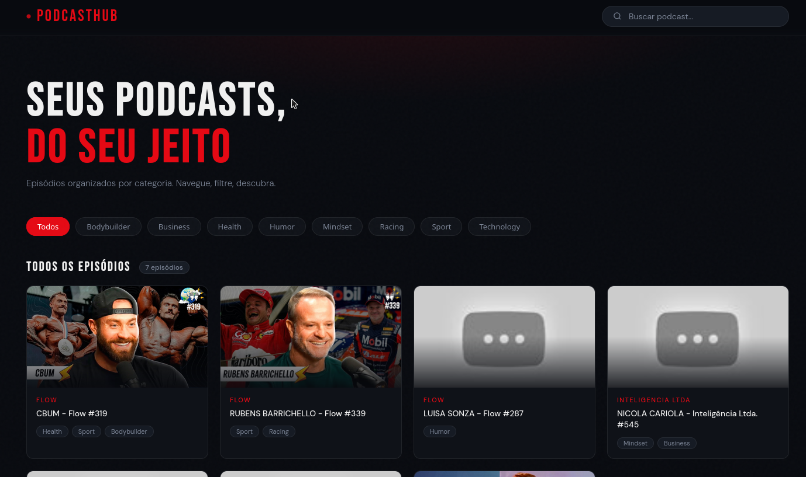

# 🎙️ Podcast Manager

> API REST construída com **Node.js + TypeScript** usando apenas o módulo HTTP nativo — sem Express, sem Fastify, sem frameworks. Arquitetura limpa em camadas com segurança OWASP implementada nativamente.



Projeto desenvolvido como desafio do **Bootcamp Node.js da DIO**. Inspirado no repositório de referência [@felipeAguiarCode](https://github.com/felipeAguiarCode/node-ts-webapi-without-frameworks-podcast-menager), expandido com camadas AppSec/DevSecOps e um frontend visual estilo Netflix.

---

## ✨ Features

- 📋 Listar todos os episódios de podcasts organizados por categoria
- 🔍 Filtrar episódios por nome do podcast via query string
- 🏷️ Categorias dinâmicas: health, sport, bodybuilder, mindset, humor, racing, technology
- 🔒 Headers de segurança OWASP nativos (equivalente ao Helmet.js, sem dependência)
- ⚡ Rate limiting em memória — 60 req/min por IP
- 🎯 TypeScript strict mode — zero erros de tipo
- 🧱 Arquitetura em camadas: Controller → Service → Repository
- 🌐 Frontend visual estilo Netflix (HTML puro, sem framework)

---

## 🖥️ Interface

O projeto inclui um frontend `index.html` que consome a API e exibe os podcasts em layout Netflix:

- Cards com thumbnail, categoria e episódio
- Filtros por categoria (pills dinâmicas)
- Busca em tempo real chamando `/api/episode`
- Clique no card abre o episódio no YouTube
- Status bar mostrando se a API está online

Para usar: abra `index.html` com Live Server (porta 5500) com a API rodando na porta 3333.

---

## 🔌 Endpoints

| Método | Rota | Descrição |
|--------|------|-----------|
| GET | `/health` | Health check — retorna status e timestamp |
| GET | `/api/list` | Lista todos os episódios |
| GET | `/api/episode?podcastName=flow` | Filtra episódios por nome do podcast |

### Exemplos de resposta

**GET /api/list**
```json
[
  {
    "podcastName": "flow",
    "episode": "CBUM - Flow #319",
    "videoId": "pQSuQmUfS30",
    "cover": "https://i.ytimg.com/vi/pQSuQmUfS30/maxresdefault.jpg",
    "link": "https://www.youtube.com/watch?v=pQSuQmUfS30",
    "categories": ["health", "sport", "bodybuilder"]
  }
]
```

**GET /api/episode?podcastName=flow** → retorna apenas episódios do Flow  
**GET /api/episode?podcastName=FLOW** → case-insensitive, funciona igual  
**GET /api/episode?podcastName=xyz** → HTTP 204 (não encontrado, body vazio)

---

## 🗂️ Estrutura do projeto

```
podcast-manager/
├── src/
│   ├── server.ts                      # Entry point — cria o servidor HTTP
│   ├── routes/
│   │   └── router.ts                  # Roteamento sem strings soltas
│   ├── controllers/
│   │   └── podcast.controller.ts      # Lida com req/res, delega para service
│   ├── services/
│   │   └── podcast.service.ts         # Lógica de negócio e sanitização
│   ├── repositories/
│   │   └── podcast.repository.ts      # Fonte de dados (in-memory)
│   ├── models/
│   │   └── podcast.model.ts           # Interface + enum de categorias
│   ├── middlewares/
│   │   └── security.middleware.ts     # Headers OWASP + rate limiting
│   └── utils/
│       ├── http-status-code.util.ts   # Sem números mágicos
│       └── routes.util.ts             # Sem strings flutuantes
├── index.html                         # Frontend estilo Netflix
├── .env.example
├── tsconfig.json
├── package.json
└── SECURITY_REPORT.md
```

---

## 🚀 Como rodar

### Pré-requisitos
- Node.js 18+
- npm

### Desenvolvimento

```bash
# Clone o repositório
git clone https://github.com/taissocout/podcast-manager.git
cd podcast-manager

# Instale as dependências
npm install

# Copie o arquivo de ambiente
cp .env.example .env

# Inicie o servidor com hot reload
npm run start:dev
```

### Build para produção

```bash
npm run build
npm start
```

### Verificação de tipos

```bash
npm run lint
```

O servidor sobe em `http://localhost:3333` por padrão. Altere `PORT` no `.env` para usar outra porta.

### Frontend visual

Com a API rodando, abra o `index.html` com o Live Server do VS Code ou:

```bash
npx live-server --port=5500 --open=index.html
```

---

## 🛡️ Segurança

Veja [SECURITY_REPORT.md](./SECURITY_REPORT.md) para o relatório completo com outputs reais.

| Camada | Implementação |
|--------|---------------|
| Security Headers | X-Content-Type-Options, X-Frame-Options, X-XSS-Protection, CSP, Referrer-Policy |
| Rate Limiting | 60 req/min por IP — retorna 429 com Retry-After |
| Input Sanitization | Query params: trim + lowercase antes do uso |
| Sem exposição de stack trace | Erros retornam apenas mensagens seguras |
| Zero dependências de runtime | Menor superfície de ataque |
| TypeScript Strict | `strict: true` — elimina null/undefined em runtime |

---

## 🧰 Stack

| Tecnologia | Uso |
|------------|-----|
| Node.js 18+ | Runtime — módulo HTTP nativo |
| TypeScript 5 | Linguagem — strict mode |
| tsup | Build/bundle (CJS + tipos) |
| tsx | Dev server com hot reload |
| @types/node | Definições de tipo |

---

## 📋 Histórico de commits

```
chore: initial project setup with TypeScript and tsup
feat: add podcast model interface and category enum
chore: add utility constants to eliminate magic numbers and strings
feat: implement podcast repository with sample dataset
feat: create podcast service with list and filter business logic
feat: implement podcast controller for HTTP request handling
security: implement OWASP headers and rate limiting middleware
feat: add request router with clean route constants
feat: create HTTP server entry point with env-based port config
docs: add professional README and SECURITY_REPORT
```

---

## 📄 Licença

MIT — veja [LICENSE](./LICENSE)
